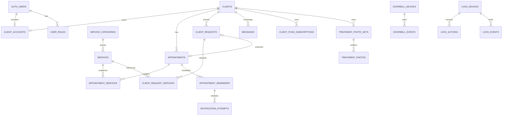

# Frizerski salon Kristina — arhitektura baze V2

## Svrha i mjerodavni izvori

Ovaj dokument definira ciljnu, postupno ostvarivu arhitekturu podataka. Cilj nije
ponovno izgraditi aplikaciju, nego stabilizirati model koji već radi i spriječiti
daljnje dodavanje međusobno preklopljenih stupaca i RPC funkcija.

Pregledani su:

- `supabase/schema.sql`;
- sve lokalne migracije u `supabase/migrations`;
- neprimijenjeni ručni SQL
  `supabase/manual/20260728_flexible_appointment_confirmation_flow.sql`;
- TypeScript modeli u `src/types.ts` i `src/portalTypes.ts`;
- Supabase mapiranja i tokovi u administratorskom i klijentskom portalu;
- poruke, podsjetnici, push pretplate i privatna arhiva fotografija;
- `DoorbellService`, njegova mock implementacija i Salon Dashboard.

### Važna napomena o stvarnom stanju

`supabase/schema.sql` je stari budući nacrt. Koristi `text` identifikatore,
`profiles` i hrvatske statuse, dok kasnije migracije i aplikacija očekuju
`uuid`, `clients.user_id`, `user_roles` i engleske statuse baze. Zato se
`schema.sql` **ne smije** primjenjivati niti koristiti kao jedini izvor istine.

Najpouzdaniji lokalni opis produkcijskog modela čine:

1. inspekcija stvarne baze na kojoj je izrađena migracija od 24. srpnja;
2. redoslijed poslije primijenjenih inkrementalnih migracija;
3. kod koji trenutačno čita i zapisuje Supabase podatke.

Lokalne migracije ipak nisu potpuna zamjena za novi read-only katalog produkcije.
Prije svake V2 faze treba provjeriti stvarne stupce, constrainte, funkcije,
politike i potpise u produkciji.

## Arhitektonska načela

- Svi poslovni entiteti koriste `uuid`.
- `auth.users.id` je identitet računa, a `clients.id` identitet osobe u kartoteci.
- Klijent može postojati bez portala i bez `auth.users` računa.
- Klijentski pristup uvijek se izvodi iz `auth.uid()`, nikada iz `client_id`
  primljenog od frontenda.
- Administratorske ovlasti imaju jedno mjesto istine: `user_roles` i
  `public.is_admin()`.
- Povijesni termini čuvaju snapshot tretmana, cijena i trajanja.
- Životni status, potvrda klijenta i naplata odvojene su domene.
- Statusi se mijenjaju kroz mali broj poslovnih RPC transakcija.
- RLS je zadnja zaštitna linija; frontend nije sigurnosna granica.
- Brisanje poslovnih zapisa izbjegava se. Preferiraju se arhiviranje, status i
  audit događaji.

## 1. Klijenti i korisnički računi

### Postojeće stanje

- `auth.users` sadrži Supabase račune, uključujući anonimne klijentske sesije.
- `clients` je kartoteka. Produkcijski model koristi `clients.id uuid`,
  `clients.user_id uuid`, telefon i `is_active`.
- `user_roles` veže administratorske račune uz ulogu. `is_admin()` je centralna
  provjera administratora.
- `client_portal_credentials` je 1:1 s klijentom i sadrži hash PIN-a, status
  aktivacije, privremeni PIN, broj neuspjelih pokušaja i blokadu.
- Naknadna migracija dodaje šifriranu, administratoru čitljivu kopiju PIN-a i
  zasebno zaključano spremište ključa.
- `client_portal_login_guards` ograničava pokušaje po auth računu.
- Dio kompatibilnog SQL-a prepoznaje mogući `client_accounts`, ali glavni
  produkcijski tok koristi `clients.user_id`.

### Ciljni model

`clients` ostaje glavni identitet osobe:

- `id uuid PK`;
- `first_name`, `last_name`;
- `phone_normalized`, uz zasebno formatirani telefon samo ako je potreban;
- `is_active`;
- `portal_status` nije potreban ako se može izvesti iz računa/credentials zapisa;
- `created_at`, `updated_at`, opcionalno `archived_at`.

Preporučeni `client_accounts`:

- `id uuid PK`;
- `client_id uuid NOT NULL FK clients(id)`;
- `auth_user_id uuid NOT NULL FK auth.users(id)`;
- `status` (`pending_activation`, `active`, `locked`, `disabled`);
- `activated_at`, `last_login_at`, `created_at`, `updated_at`;
- `UNIQUE(client_id)` i `UNIQUE(auth_user_id)`.

To je čišće od trajnog `clients.user_id`, ali prijelaz nije hitan. U Fazi A treba
zadržati postojeći `clients.user_id`. `client_accounts` se uvodi tek kada se
isplati centralizirati aktivaciju i vezu računa.

PIN tajne ostaju u zasebnoj tablici bez direktnog SELECT-a klijentu. Postavljanje
i provjera PIN-a moraju ostati serverske operacije s ograničenjem pokušaja.

### Poslovna pravila

- Kristina može napraviti `clients` zapis prije aktivacije portala.
- Neaktiviran klijent nema `auth_user_id`; kartoteka i termini normalno rade.
- Aktivacija u jednoj transakciji zaključava klijenta, provjerava telefon i veže
  točno jedan `auth.users` račun.
- Jedinstveni indeks treba koristiti normalizirani telefon samo ako je potvrđeno
  da članovi obitelji nikada ne dijele isti broj. Inače treba administrativni
  postupak za razrješenje podudaranja, a ne slijepi unique constraint.
- Pretraga prije stvaranja mora koristiti normalizirani telefon i upozoriti na
  moguće ime/telefon podudaranje.
- Spajanje duplikata mora biti poseban administratorski postupak s auditom, ne
  automatska radnja.

## 2. Usluge i cjenik

### Postojeće stanje

`service_categories` sadrži `code`, naziv, aktivnost i redoslijed.
`services` sadrži kategoriju, naziv, cijenu, `duration_minutes`, aktivnost,
`is_bookable`, izvorni kod i redoslijed. Administratorski RPC-ovi upravljaju
cjenikom, a read-only viewovi služe klijentskom prikazu i izboru termina.

### Ciljni model

Za sada zadržati postojeće tablice:

**service_categories**

- `id uuid PK`;
- stabilni `code UNIQUE`;
- `name`;
- `is_active`;
- `display_order`;
- timestamps.

**services**

- `id uuid PK`;
- `category_id FK`;
- `name`;
- `price numeric(10,2)`;
- `duration_minutes integer NULL`;
- buduće `active_work_minutes integer NULL`;
- `is_active`;
- `is_bookable`;
- `display_order`;
- timestamps.

Promjena naziva, cijene ili trajanja utječe samo na nove termine. Povijesni
termin mora sačuvati:

- naziv svake odabrane usluge;
- cijenu svake usluge;
- trajanje svake usluge;
- redoslijed;
- konačnu ukupnu cijenu;
- konačno ukupno trajanje.

Ako se kasnije traži povijest cjenika prije nastanka termina, dodati
`service_versions`, ali to sada nije potrebno. Snapshot u terminu dovoljan je za
poslovnu povijest.

## 3. Termini

### Ciljna tablica `appointments`

- `id uuid PK`;
- `client_id uuid FK clients`;
- `starts_at timestamptz NOT NULL`;
- `ends_at timestamptz NOT NULL`;
- `total_duration_minutes integer NOT NULL CHECK >= 15`;
- `total_price_snapshot numeric(10,2) NOT NULL`;
- `notes text`;
- `no_charge boolean NOT NULL DEFAULT false`;
- `lifecycle_status`;
- `confirmation_status`;
- budući `payment_status`, tek kad postoji poslovni zahtjev;
- `created_by uuid`, `updated_by uuid`;
- `created_at`, `updated_at`, opcionalno `cancelled_at`, `completed_at`.

### Jedno mjesto istine za statuse

**Životni status** (`appointments.lifecycle_status`, postojeći `status` može se
zadržati tijekom prijelaza):

- `scheduled`;
- `cancelled`;
- `completed`;
- `no_show`.

**Status potvrde** (`appointments.confirmation_status`):

- `not_required` — Kristina je odmah potvrdila;
- `pending_client`;
- `confirmed_by_client`;
- `confirmed_by_admin`;
- `declined_by_client`;
- `expired`.

Minimalna Faza A može početi s `pending` i `confirmed`, ali ciljna domena iznad
izbjegava skriveno zaključivanje tko je potvrdio.

**Status plaćanja** nije `no_charge`. Kada postane potreban:

- `not_recorded`;
- `unpaid`;
- `paid`;
- `refunded`;
- `waived`.

`no_charge` trenutno samo bilježi da naplate nije bilo. Ne zaključuje ništa o
fiskalnom računu.

Termin bez tretmana je dopušten: nema redaka u `appointment_services`, ali mora
imati ručno uneseno trajanje. Naziv prikaza je „Termin bez tretmana”.

Preklapanje se ne zabranjuje constraintom jer administrator smije napraviti
override. RPC treba izračunati preklapanje i vratiti upozorenje ili zahtijevati
eksplicitni `allow_overlap = true`. Kasniji model faza usluge može preciznije
odrediti stvarno zauzeće.

Otkazani termin ne zauzima raspored. `pending_client` termin zauzima vrijeme jer
je stvarni termin s početkom i završetkom.

## 4. Više usluga

### Termini

`appointment_services` je ispravan normalizirani model:

- `appointment_id uuid FK`;
- `service_id uuid NULL FK` — može biti NULL ako je usluga kasnije uklonjena;
- `position integer`;
- `service_name_snapshot text`;
- `service_price_snapshot numeric`;
- `service_duration_snapshot integer NULL`;
- budući `active_work_minutes_snapshot integer NULL`;
- budući `waiting_minutes_snapshot integer NULL`;
- `included boolean NOT NULL DEFAULT true` ili, bolje, `removed_at`;
- `created_at`, `updated_at`;
- PK `id uuid`, uz unique aktivne pozicije po terminu.

Postojeći složeni PK `(appointment_id, service_id)` sprječava količinu iste
usluge. To je danas prihvatljivo, ali zasebni `id` je fleksibilniji i omogućuje
dvije jednake stavke ako se kasnije uvede količina.

`is_selected` čuva stare veze, ali miješa trenutačni sastav termina s tehničkom
poviješću. Preporuka je da aktivni redovi predstavljaju trenutačni sastav, a
povijest promjena ide u audit/status-history tablicu. Ako se želi soft removal,
`removed_at` je jasniji od `is_selected`.

### Klijentski zahtjevi

Array pristup (`service_ids uuid[]`, `service_names text[]`):

Prednosti:

- mala migracija;
- jednostavan jedan INSERT;
- brz prijelaz postojećeg frontenda.

Nedostaci:

- nema FK integriteta za svaki element;
- dva paralelna arraya lako se raziđu;
- redoslijed i snapshot nisu povezani jednim retkom;
- upiti, RLS i izvještaji su složeniji;
- teško se dodaju trajanje, cijena, količina i faze.

Normalizirani `client_request_services`:

- `id uuid PK`;
- `request_id uuid FK client_requests`;
- `service_id uuid NULL FK services`;
- `position integer`;
- `service_name_snapshot text`;
- `service_price_snapshot numeric`;
- `service_duration_snapshot integer NULL`;
- `created_at`;
- `UNIQUE(request_id, position)`.

Prednosti:

- referencijalni integritet;
- pouzdan redoslijed;
- snapshot u istom retku;
- jednostavniji admin prikaz i pretvaranje zahtjeva u termin;
- proširivost bez novih array stupaca.

Nedostatak je jedan dodatni join i nešto složeniji transakcijski INSERT.

**Preporuka: koristiti `client_request_services`, ne array stupce.**

## 5. Klijentski zahtjevi

`client_requests` treba podržati:

- `id`, `client_id`;
- `kind`: `appointment`, `change`, `cancellation`;
- `related_appointment_id` za promjenu/otkazivanje;
- `day_period`;
- `client_message`;
- `admin_reply`;
- `status`;
- `proposed_appointment_id`;
- `admin_read_at`, `client_read_at`;
- timestamps.

Više željenih datuma može kratkoročno ostati `preferred_dates date[]` jer su to
jednostavne vrijednosti bez vlastitih atributa. Ako se uvedu prioriteti ili
različiti dijelovi dana po datumu, tada dodati `client_request_preferences`.

Status zahtjeva:

- `pending`;
- `in_review`;
- `proposal_sent`;
- `accepted`;
- `declined`;
- `needs_new_proposal`;
- `rejected`;
- `closed`;
- `cancelled`.

Promjene statusa trebaju se bilježiti u `request_status_history`.

### Predloženi termin

**Preporuka: predloženi termin je stvarni `appointments` zapis sa
`confirmation_status = pending_client`.**

Razlozi:

- odmah rezervira vrijeme u jedinom kalendaru;
- preklapanje i prikaz koriste isti model;
- nema utrke između prihvaćanja prijedloga i naknadnog stvaranja termina;
- prihvaćanje je idempotentna promjena statusa, ne novi INSERT.

`client_requests.proposed_appointment_id` mora biti unique gdje nije NULL, čime
jedan zahtjev ne može proizvesti dvostruki termin. Odbijanje prijedloga otkazuje
ili arhivira rezervirani termin i dopušta novi prijedlog. Novi prijedlog dobiva
novi appointment radi čiste povijesti.

## 6. Poruke

Postojeća `messages` tablica već podržava klijenta, pošiljatelja, sadržaj,
predmet, parent poruku, read/archive stanje i vidljivost po strani. Za salon s
jednim administratorom puna struktura `conversations` +
`conversation_participants` bila bi nepotrebno složena.

Preporuka:

- zadržati jednu `messages` tablicu;
- dodati opcionalne `request_id` i `appointment_id`;
- zadržati `client_id` kao razgovor;
- koristiti `sender_role` (`client`, `admin`, `system`);
- odvojiti `admin_read_at` i `client_read_at`;
- koristiti `archived_at` ili vidljivost po strani;
- trajno brisanje ograničiti na administratora i arhivirane poruke ili ga
  zamijeniti soft deleteom.

Sistemske poruke koje moraju biti dio razgovora mogu biti `sender_role=system`.
Operativne obavijesti i pokušaji dostave ne pripadaju u `messages`.

Ako se kasnije uvede više zaposlenika ili grupni razgovori, tek tada uvesti
`conversations` i sudionike.

## 7. Obavijesti i podsjetnici

Treba razlikovati četiri sloja:

1. **Poslovni događaj** — npr. termin predložen, potvrđen, promijenjen ili otkazan.
2. **Planirana obavijest** — što treba poslati, kome, kojim kanalom i kada.
3. **Pokušaj slanja** — pojedini pokušaj prema web-pushu ili SMS provideru.
4. **Rezultat dostave** — prihvaćeno, poslano, neuspjelo ili trajno odbačeno.

Zadržati i doraditi `appointment_reminders` kao `notifications`/`notification_jobs`:

- `id`, `client_id`, `appointment_id`;
- `event_type`;
- `channel`: `in_app`, `web_push`, `sms`;
- `scheduled_for`;
- neutralni naslov i tijelo;
- `status`: `scheduled`, `processing`, `sent`, `cancelled`, `failed`;
- `deduplication_key UNIQUE`;
- `attempt_count`, `last_error_code`;
- timestamps.

Dodati `notification_attempts`:

- `notification_id`;
- `attempt_no`;
- `provider`;
- `provider_message_id` ako nije tajna;
- `started_at`, `finished_at`;
- `status`, sanitizirani error code.

Duplo slanje sprječavaju:

- deterministički `deduplication_key`;
- unique constraint;
- zaključavanje reda prije slanja;
- idempotency key prema provideru gdje postoji;
- odvojeni zapis svakog pokušaja.

Promjena ili otkazivanje termina mora otkazati buduće reminder zapise za staru
verziju i stvoriti nove s novim deduplication ključem. Push subscription endpoint
i kriptografski materijal ostaju potpuno skriveni od direktnog SELECT-a.

## 8. Doorbell

Postojeći `DoorbellService` već ispravno odvaja aplikaciju od proizvođača:

- `isOnline()`;
- `lastRing()`;
- `batteryLevel()`;
- `startLiveView()`;
- `openDoor()`.

Mock vraća offline/null i nema vanjskih učinaka.

Buduće tablice:

**doorbell_devices**

- `id uuid PK`;
- `provider text`;
- `external_device_id text`;
- `name`;
- `integration_status`;
- `is_enabled`;
- `last_seen_at`;
- `battery_level`;
- timestamps;
- `UNIQUE(provider, external_device_id)`.

**doorbell_events**

- `id uuid PK`;
- `device_id FK`;
- `event_type`: `ring`, `motion`, `online`, `offline`, `battery`;
- `occurred_at`;
- `battery_level`;
- `snapshot_path` ili provider referenca;
- sanitizirani `provider_event_id`;
- `UNIQUE(device_id, provider_event_id)` gdje postoji.

Baza sprema poslovno relevantne uređaje, događaje, status i privatnu putanju
snimke. Adapter čuva provider API pozive, tok videa, tokene, potpisivanje,
mapiranje vendor payloadova i retry logiku. Tajne idu u Edge Function secrets,
nikada u tablicu dostupnu frontendu.

Model nije vezan uz Tapo.

## 9. Pametna brava

Ovo se sada **ne implementira**. Ciljna arhitektura ostavlja:

**lock_devices**

- `id`, `provider`, `external_device_id`, naziv, status integracije, last seen.

**lock_access_grants**

- uređaj, korisnik/klijent, valjanost od/do, razlog, opozvano vrijeme.

**lock_actions**

- `lock`/`unlock` zahtjev;
- izvor (`manual_admin`, `automation`, `temporary_grant`);
- `requested_by`;
- `requested_at`;
- rezultat i završetak;
- correlation/idempotency key.

**lock_events**

- fizički događaj, stanje brave, vrijeme, provider event ID.

Svako otključavanje mora imati nepromjenjivi audit: tko/što je tražilo akciju,
rezultat i uređaj. Automatsko otključavanje mora biti eksplicitno omogućeno,
ograničeno pravilom i opozivo.

## 10. Uređaji i tablet

`salon_devices` ima smisla tek kad tablet dobije vlastite ovlasti ili pouzdani
identitet:

- `id uuid PK`;
- `name`;
- `device_type`: `salon_tablet`, `admin_phone`;
- `auth_user_id` ili poseban device principal;
- `status`;
- `last_seen_at`;
- `capabilities` kao mali kontrolirani skup;
- `created_at`, `revoked_at`.

Ne spremati puni user-agent, fingerprint, IMEI, MAC adresu ni nepotrebne detalje
preglednika. Push pretplata može imati `salon_device_id`, ali klijentske
pretplate ostaju vezane uz klijenta/račun.

Registrirani tablet nije zamjena za administratorsku autentifikaciju. Za
osjetljive radnje treba aktivna admin sesija.

## 11. Audit i povijest

Preporučene tablice:

**audit_log**

- `id`;
- `actor_user_id`;
- `actor_role`;
- `action`;
- `entity_type`, `entity_id`;
- `occurred_at`;
- mali `metadata jsonb` bez tajni i PIN-ova.

**appointment_status_history**

- termin;
- prethodni i novi lifecycle/confirmation status;
- actor;
- razlog;
- vrijeme.

**request_status_history**

- zahtjev;
- prethodni/novi status;
- actor;
- poruka ili razlog;
- vrijeme.

Doorbell i lock događaji ostaju u svojim domenskim event tablicama, a sigurnosno
važna administratorska akcija može dodatno dobiti audit zapis.

Trajno treba moći dokazati:

- tko je stvorio, potvrdio, promijenio ili otkazao termin;
- je li prijedlog prihvatio klijent ili administrator;
- tko je otvorio vrata;
- kada je obavijest planirana i kada je pokušana/poslana;
- tko je promijenio klijentski ili administratorski pristup, bez zapisa PIN-a.

Audit tablice su append-only. Klijent im nema direktan pristup. Administrator ih
čita kroz ograničeni pregled/RPC, ali ih ne mijenja ili briše.

## 12. RLS i sigurnost

| Tablica | Klijent SELECT | Klijent INSERT/UPDATE/DELETE | Administrator | Preporučeni put |
|---|---|---|---|---|
| `clients` | samo vlastiti osnovni profil | bez direktnog pisanja ili ograničeni profil RPC | sve potrebno | RLS + RPC za osjetljivo |
| `user_roles` | ništa | ništa | read preko `is_admin()` | bez frontend upravljanja |
| `client_accounts` | samo vlastiti status | ništa direktno | upravljanje kroz RPC | RPC |
| PIN credentials/guards | ništa | ništa | bez direktnog SELECT-a hashova | isključivo RPC |
| `service_categories` | aktivne | ništa | CRUD | view za klijenta, RPC za admina |
| `services` | aktivne dozvoljene projekcije | ništa | CRUD | view/RPC |
| `appointments` | samo vlastiti | nema potvrde/izmjene direktno | CRUD | SELECT RLS, promjene RPC |
| `appointment_services` | samo za vlastiti termin | ništa | kroz termin RPC | RLS + RPC |
| `client_requests` | samo vlastiti | stvaranje/odgovor RPC | svi kroz inbox RPC | RPC |
| `client_request_services` | samo za vlastiti zahtjev | kroz request RPC | kroz request RPC | RLS + RPC |
| `messages` | samo vlastite vidljive | slanje/čitanje kroz RPC | inbox/chat RPC | RPC |
| notifications/reminders | samo vlastite in-app | ništa | upravljanje/job worker | RLS + backend |
| notification attempts | ništa | ništa | ograničeni read | backend/service role |
| push subscriptions | ništa direktno | spremanje vlastite kroz RPC | Edge Function | RPC/backend |
| treatment photo sets/photos | samo vlastite i vidljive | ništa | CRUD | RLS |
| `doorbell_devices/events` | ništa | ništa | read/manage prema ovlasti | backend + admin |
| `lock_*` | ništa | ništa | strogo RPC | Edge Function/RPC |
| audit/history | eventualno vlastita povijest termina | ništa | read-only | append-only backend |

Svaka `SECURITY DEFINER` funkcija mora:

- imati `set search_path = ''`;
- provjeriti `auth.uid()` ili `is_admin()`;
- izvoditi `client_id` iz autentificiranog računa;
- ne prihvaćati frontend `client_id` kao dokaz vlasništva;
- imati `REVOKE` za `public` i `anon`;
- dobiti samo nužni `GRANT EXECUTE`;
- ne vraćati PIN hash, salt, push ključeve ili provider tajne;
- biti idempotentna za ponovljeni klik gdje nastaje nov poslovni zapis.

## 13. RPC arhitektura

### `admin_save_appointment_with_services`

Zadržati kao jednu transakcijsku naredbu jer spremanje termina i njegovih usluga
mora biti atomsko. Funkcija je velika, ali domena je jedna. Doraditi:

- jasno odvojeni lifecycle i confirmation status;
- `allow_overlap`;
- idempotentno ažuriranje child redaka;
- audit/status history;
- stabilan rezultat koji vraća spremljeni termin, ne samo ID.

### `client_submit_request`

Zadržati kao jedan RPC, ali arraye zamijeniti JSON ulazom koji se validira i
upisuje u `client_request_services`, ili zasebnim kompozitnim tipom. Funkcija mora
izvesti klijenta iz `auth.uid()` i transakcijski spremiti zahtjev i tretmane.

### `admin_propose_client_request`

Zadržati. Treba u jednoj transakciji:

- zaključati zahtjev;
- provjeriti status;
- stvoriti rezervirani pending appointment ili prihvatiti prethodno stvoren ID;
- povezati isti `client_id`;
- zabilježiti povijest;
- spriječiti dvostruki prijedlog.

Bolje je da sam RPC stvori termin nego da frontend prvo pozove save appointment,
a zatim propose RPC. Time nema napuštenog pending termina ako drugi poziv ne
uspije.

### `client_respond_to_proposed_request`

Zadržati. Mora zaključati vlastiti zahtjev i povezani termin te atomski potvrditi
ili odbiti prijedlog. Klijent nikad ne bira proizvoljni appointment ID.

### `admin_confirm_pending_appointment`

Može ostati mali, jasno imenovan RPC. Treba potvrditi samo pending termin,
zabilježiti `confirmed_by_admin` i status history. Ako se ista logika prirodno
uključi u opći `admin_transition_appointment`, zasebna funkcija može se poslije
ukinuti, ali sada je jasnija i sigurnija.

### Logika baze nasuprot TypeScriptu

U bazi ostaju:

- autorizacija i vlasništvo;
- atomsko spremanje parent/child redaka;
- tranzicije statusa;
- snapshot iz službenog cjenika;
- idempotency i audit;
- sprječavanje dvostrukog termina iz zahtjeva.

U TypeScriptu ostaju:

- prikaz i formatiranje;
- izbor i redoslijed tretmana prije slanja;
- korisnička upozorenja o preklapanju;
- lokalni izračun prijedloga cijene/trajanja, uz serversku ponovnu validaciju;
- upravljanje modalima i kalendarom.

Ne treba stvarati RPC za svaki pojedini SELECT ili trivijalnu UI radnju.

## 14. Predložena ciljna shema

| Tablica | Svrha i ključna pravila |
|---|---|
| `clients` | Kartoteka; PK UUID; normalizirani telefon; arhiviranje umjesto brisanja |
| `user_roles` | Uloge auth korisnika; unique `(user_id, role)` |
| `client_accounts` | Jednoznačna veza klijenta i auth računa; oba FK-a unique |
| `client_portal_credentials` | PIN hash/status/blokada; bez direktnih grantova |
| `client_portal_login_guards` | Serversko ograničenje pokušaja |
| `service_categories` | Stabilni kod, aktivnost i redoslijed |
| `services` | Cjenik, trajanje, bookable/active i redoslijed |
| `appointments` | Vrijeme, ukupni snapshot, tri odvojena statusna područja |
| `appointment_services` | Normalizirani snapshot tretmana i redoslijed |
| `appointment_status_history` | Append-only životni i confirmation prijelazi |
| `client_requests` | Zahtjev, komunikacija i veza na prijedlog/termin |
| `client_request_services` | Normalizirane željene usluge sa snapshotima |
| `request_status_history` | Append-only tranzicije zahtjeva |
| `messages` | Jedan razgovor salon–klijent, opcionalna veza na zahtjev/termin |
| `appointment_reminders` | Planirana dostava po kanalu i deduplication ključ |
| `notification_attempts` | Pokušaji i rezultati slanja |
| `client_push_subscriptions` | Privatne pretplate po klijentu/uređaju |
| `treatment_photo_sets` | Tretman i klijentska vidljivost |
| `treatment_photos` | Privatne storage putanje i faza fotografije |
| `salon_devices` | Minimalni registar odobrenih salonskih uređaja |
| `doorbell_devices` | Provider-neutralni uređaji zvona |
| `doorbell_events` | Ring/motion/status/battery događaji |
| `lock_devices` | Budući uređaji brave |
| `lock_access_grants` | Buduća privremena prava pristupa |
| `lock_actions` | Budući zahtjev i rezultat lock/unlock akcije |
| `lock_events` | Budući fizički događaji brave |
| `audit_log` | Append-only sigurnosni i poslovni audit |

Važni indeksi:

- appointments `(starts_at)`, `(client_id, starts_at desc)`,
  djelomični indeks aktivnih termina;
- appointment_services `(appointment_id, position)`;
- client_requests `(status, created_at desc)` i `(client_id, created_at desc)`;
- client_request_services `(request_id, position)`;
- messages `(client_id, created_at)` i djelomični unread indeksi;
- reminders `(status, scheduled_for)`;
- device events `(device_id, occurred_at desc)`.

Pravila brisanja:

- klijente, termine, zahtjeve i audit ne brisati u normalnom radu;
- deaktivirati/arhivirati;
- child snapshoti ne smiju nestati kad se usluga deaktivira;
- storage objekt brisati samo koordinirano s metapodatkom;
- push pretplate smiju se ukloniti kad provider potvrdi trajnu nevaljanost;
- cleanup TEST podataka ostaje zaseban, precizno označen postupak.

## 15. Fazni migracijski plan

### Faza A — aktualni termini i više usluga

1. Read-only provjera produkcijskih tipova, constrainta, potpisa i broja redaka.
2. Dodati `appointments.confirmation_status` s kompatibilnim defaultom.
3. Učvrstiti `appointment_services` kao trenutačni normalizirani sastav termina.
4. Dodati `client_request_services`, bez array stupaca.
5. Backfill postojećih zahtjeva samo kada se naziv može jednoznačno mapirati;
   ostale ostaviti na legacy `service` prikazu.
6. Zamijeniti relevantne RPC potpise, uz privremeno zadržavanje legacy overloadova.
7. Prebaciti frontend na nove child retke.
8. Provjeriti broj i snapshot postojećih termina prije/poslije.
9. Tek nakon stabilnog razdoblja označiti legacy stupce zastarjelima; ne brisati ih.

### Faza B — poruke i obavijesti

1. Konsolidirati značenje read/archive/delete stupaca u `messages`.
2. Dodati opcionalne veze na zahtjev i termin.
3. Uvesti stabilan deduplication key za reminders.
4. Dodati `notification_attempts`.
5. Zadržati postojeći Web Push Edge Function i privatne pretplate, uz audit slanja.

### Faza C — DoorbellService i događaji

1. Dodati `doorbell_devices` i `doorbell_events`.
2. Implementirati jedan provider adapter iza postojećeg sučelja.
3. Tajne držati u backendu.
4. Spojiti Realtime/read-only dashboard tek nakon RLS provjere.

### Faza D — pametna brava i audit

1. Uvesti opći `audit_log` i status histories.
2. Tek nakon sigurnosnog dizajna dodati `lock_devices`, grants, actions i events.
3. Zahtjev za otključavanje izvoditi isključivo server-side.
4. Provesti zasebnu sigurnosnu reviziju prije omogućavanja stvarne brave.

Svaka faza je mala, aditivna, transakcijska gdje je moguće i ima preflight te
read-only postflight provjere. Ne radi se veliko jednokratno prepisivanje baze.

## 16. Odluka o `20260728_flexible_appointment_confirmation_flow.sql`

### `appointments.confirmation_status` — ZADRŽATI, IZMIJENITI

Koncept je potreban i mora biti jedino mjesto istine za potvrdu. Za skori rad može
početi s `pending/confirmed`, ali treba planirati bogatije vrijednosti ili barem
`confirmed_by`/history kako bi bilo jasno tko je potvrdio.

### `client_requests.service_ids` i `service_names` — IZBACITI

Ne primjenjivati array stupce. Zamijeniti ih tablicom
`client_request_services`. Legacy `client_requests.service` ostaje kao
kompatibilni prikaz dok se postojeći zapisi ne obrade.

### `appointment_services.is_selected` — IZBACITI / ZAMIJENITI

Boolean tehnički čuva uklonjene veze, ali stvara dvije vrste redaka u operativnoj
tablici i zahtijeva da svaki SELECT pamti filter. Trenutačni sastav neka budu
stvarni retci; povijest neka ide u status/audit ili, ako je soft removal nužan,
koristiti jasno `removed_at`.

### `bookable_service_prices` view — ZADRŽATI, USKLADITI

View je koristan read-only ugovor za klijentski izbor. Treba potvrditi postojeći
potpis i izložiti samo nužna polja. Administrator i dalje koristi svoje RPC-ove.

### `admin_save_appointment_with_services` — ZADRŽATI, IZMIJENITI

Zadržati atomsku funkciju. Ukloniti oslanjanje na `is_selected`, dodati jasne
statusne vrijednosti, serversku validaciju i audit. Nula tretmana mora biti
dopuštena uz valjano trajanje.

### `client_submit_request` — ZADRŽATI, IZMIJENITI

Zadržati jednu transakcijsku operaciju, ali spremati tretmane u
`client_request_services`, ne u arraye. Klijent se izvodi iz `auth.uid()`.

### `admin_propose_client_request` — ZADRŽATI, IZMIJENITI

RPC treba sam atomski napraviti rezervirani pending appointment i povezati ga sa
zahtjevom. Trenutačni dvokoračni frontend može ostaviti napušten termin ako drugi
poziv ne uspije.

### `client_respond_to_proposed_request` — ZADRŽATI, IZMIJENITI

Zadržati, zaključati zahtjev i termin, provjeriti vlasništvo i provesti
idempotentnu tranziciju. Parametar koji nije potreban ne zadržavati samo radi
razlikovanja overload potpisa.

### `admin_confirm_pending_appointment` — ZADRŽATI

Mali sigurni RPC ima jasno poslovno značenje. Dodati zapis tko je i kada
potvrdio.

### Konačna preporuka

**C) Zamijeniti postojeću neprimijenjenu migraciju novom migracijom.**

To nije potpuni redizajn baze. Nova Faza A treba zadržati dobre dijelove
postojećeg rada — eksplicitni confirmation status, termin koji zauzima kalendar,
termin bez tretmana i atomsko spremanje više tretmana — ali odmah koristiti
`client_request_services`, izostaviti `is_selected` i objediniti stvaranje
pending termina s administratorskim prijedlogom.

Ovo je sigurnije nego primijeniti privremene arraye i boolean pa ih uskoro
migrirati. Aplikacija već ima podatke, ali sporna migracija još nije primijenjena,
pa je sada najjeftiniji trenutak za ispravan normalizirani model.

## Otvorene odluke vlasnika

1. Smiju li dva klijenta dijeliti isti broj telefona?
2. Ostaje li administratorski čitljiv klijentski PIN dugoročni poslovni zahtjev,
   unatoč većem sigurnosnom riziku, ili se vraća reset-only model?
3. Treba li odbijeni pending termin ostati kao otkazani audit zapis ili se može
   arhivirati u zasebnu povijest?
4. Koji statusi potvrde moraju biti vidljivi korisnicima: samo
   pending/confirmed ili i tko je potvrdio?
5. Treba li aplikacija uskoro pratiti naplatu ili je `no_charge` dovoljan?
6. Smije li ista usluga biti dodana više puta uz količinu?
7. Treba li radno aktivno vrijeme i čekanje modelirati po usluzi ili po
   konkretnom terminu?
8. Koliko dugo čuvati poruke, fotografije, push pokušaje i audit?
9. Hoće li salon imati više administratora/zaposlenika s različitim ovlastima?
10. Koji će prvi proizvođač zvona biti pilot i podržava li službeni API/webhook?
11. Smije li buduća brava ikada automatski otključavati ili samo na ručnu
    potvrdu administratora?
